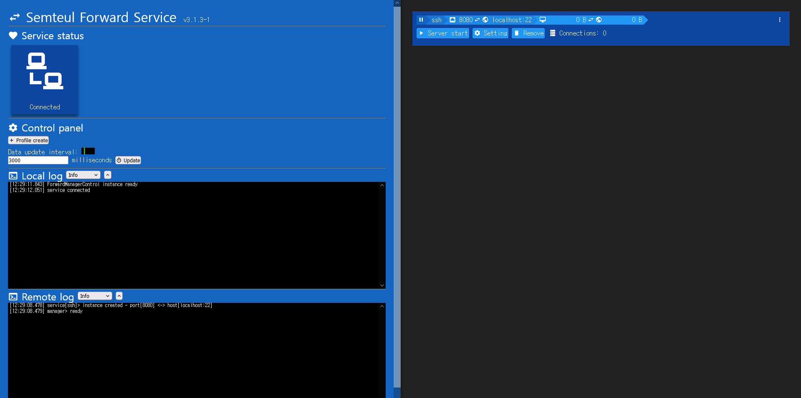

#  Semteul Forward Service 3
> ⚠️ Purpose of this project is archive my childhood code. It may not be suitable for production.

*****<div style="text-align: center;">Simple local port forward service with web console<br/>웹 콘솔을 포함한 간단한 로컬 포트포워딩 서비스</div>*****

## 📷 Screenshot


## 🧱 Requirement
- [Node.js](https://nodejs.org/en/)

## ⚡ How to run
1. Enter command
```bash
# Build webpack
npm run build
# Start koa.js with socket.io server
npm start

# Or single command
npm run all
```
2. Open browser http://localhost:9998/ (default port)


## 📦 Misc docs
- [./lib/forward-service-spec.md (KR)](./lib/forward-service-spec.md)
- [./lib/forward-service-spec-renew.md (KR)](./lib/forward-service-spec-renew.md)

## 🔭 Origin story
보안이라는 이유로 외부로 접속할 수 있는 포트가 제한된 환경에서 NAS에 설치해 기본 포트들을 변경해 접속하기 위한 수단으로 사용했었음
